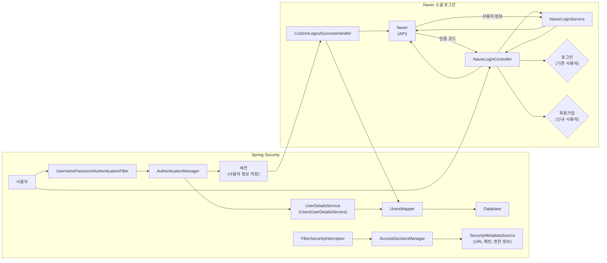

## All's - 함께 성장하는 스터디 플랫폼

**All's**는 사용자들이 스터디 그룹을 형성하고 학습 자료를 공유하며 함께 성장할 수 있는 플랫폼입니다. 다양한 학습 관리, 정보 제공, 취업 지원 기능을 통합하여 학습자가 효율적으로 자기계발과 목표 달성에 집중할 수 있도록 돕는 포괄적인 스터디 플랫폼을 제공합니다.

**주요 기능**

* **스터디 모집 및 관리**
    * 스터디 그룹 생성 및 가입 신청
    * 스터디 멤버 관리, 일정 관리
    * 스터디 검색 및 필터링 (지역, 카테고리, 연령, 성별, 온/오프라인)
    * 지도 기반 스터디 위치 확인 및 주변 카페 검색
    * 스터디 상세 정보 조회, 좋아요, 신고 기능

* **공부 자료 공유**
    * 공부 자료(게시글) 작성 및 공유
    * 게시글 조회, 댓글 작성, 좋아요, 신고 기능
    * 파일 업로드 및 다운로드

* **캘린더**
    * 개인 캘린더 및 스터디 그룹 캘린더 제공
    * 일정 추가, 수정, 삭제
    * 월간 및 일간 뷰 제공

* **타이머**
    * 학습 시간 측정 및 기록
    * 타이머 시작, 일시 정지, 종료, 메모 기능
    * 주간 및 월간 학습 시간 시각화
    * 학습 시간 기반 등급 아이콘 부여

* **회원 관리**
    * 회원가입, 로그인, 로그아웃, 회원 정보 수정, 회원 탈퇴
    * 카카오, 네이버, 구글 소셜 로그인 지원
    * 회원 탈퇴 시 관련 데이터 삭제

* **관리자 기능**
    * 웹사이트 정보 조회, 회원 관리, 게시판 관리, 스터디 관리
    * 회원 정보 수정 및 삭제, 게시글 및 스터디 삭제

**기술 스택**

* **Back-end**
    * Spring MVC
    * MyBatis
    * Spring Security
* **Front-end**
    * HTML, CSS, JavaScript
    * jQuery
    * Bootstrap
    * Kakao Maps API
    * FullCalendar
    * Chart.js

**본인 담당**
* **세션 방식 SPRING SECURITY**
* **페이지 별 커스텀 위치/지도 기반 서비스 Kakao Map API**
* **OAuth2 SNS 로그인(NAVER)**
* **USER 관련 CRUD/ 현재 상태 표시**

* Spring Security / OAuth2 SNS 로그인(NAVER)
  

---

**함께 성장하고 싶다면 All's에서 만나요!** 
