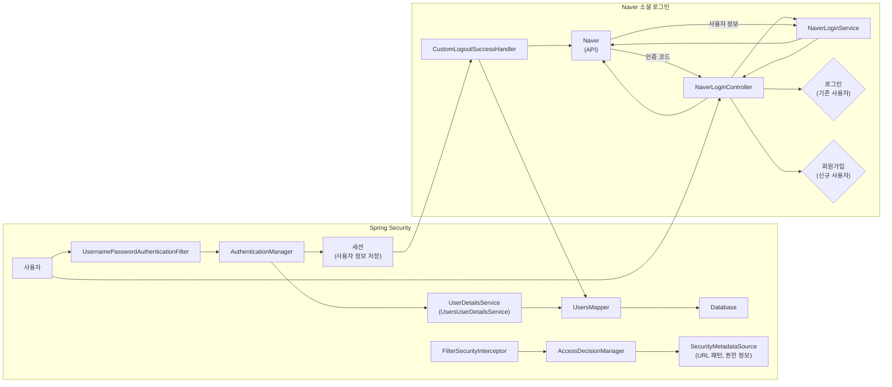
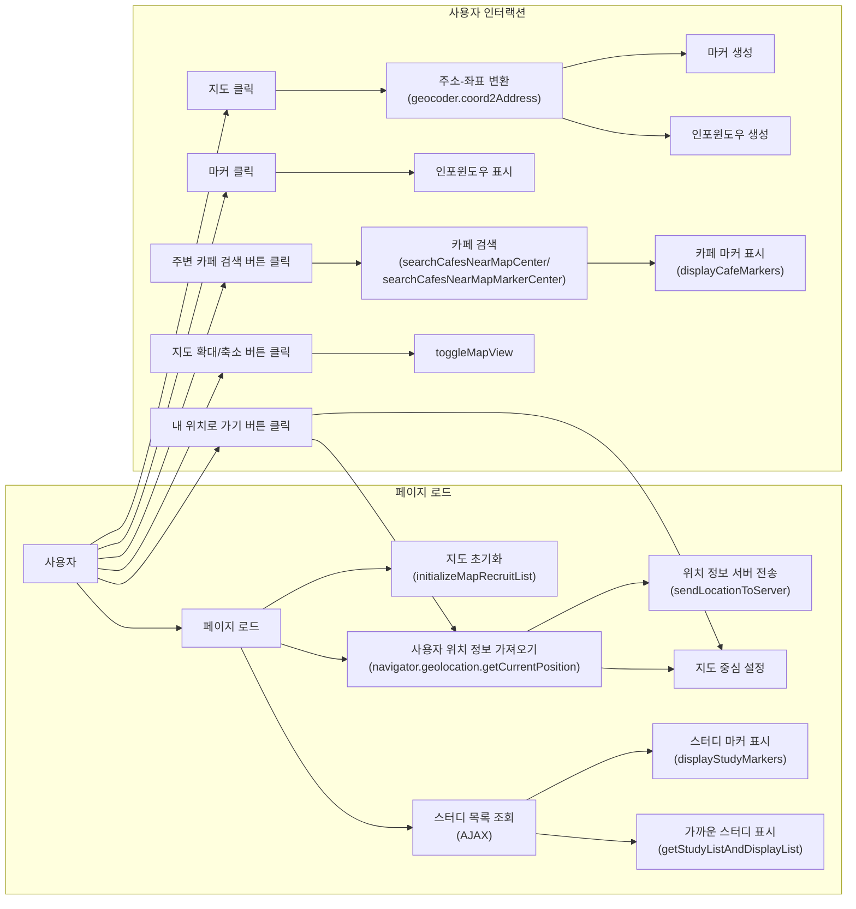
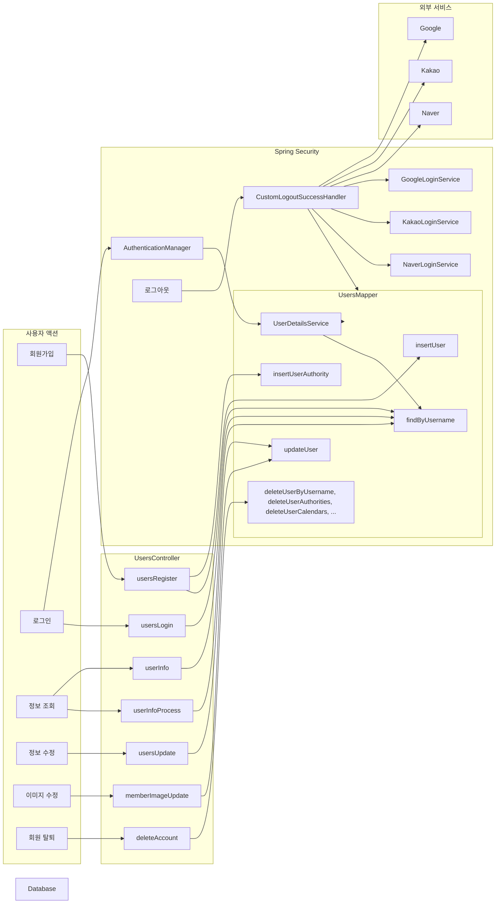
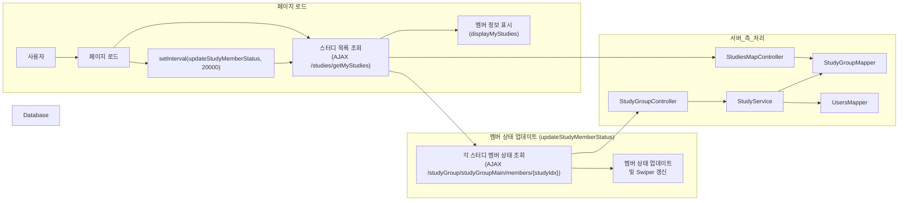

## All's - 함께 성장하는 스터디 플랫폼

**All's**는 사용자들이 위치를 기반으로 스터디 그룹을 형성하고 학습 자료를 공유하며 함께 성장할 수 있는 플랫폼입니다. 다양한 학습 관리, 정보 제공, 취업 지원 기능을 통합하여 학습자가 효율적으로 자기계발과 목표 달성에 집중할 수 있도록 돕는 포괄적인 스터디 플랫폼을 제공합니다.

**프로젝트 소개 PPT**
 

https://docs.google.com/presentation/d/1XK1DXK268ZQPuaJLk2a87NMpGAmBUac0128GzvKkXXY/pub?start=false&loop=true&delayms=10000

**주요 기능**

* **스터디 모집 및 관리**
    * 스터디 그룹 생성 및 가입 신청
    * 스터디 멤버 관리, 일정 관리
    * 스터디 검색 및 필터링 (지역, 카테고리, 연령, 성별, 온/오프라인)
    * 지도 기반 스터디 위치 확인 및 주변 카페 검색
    * 스터디 상세 정보 조회, 좋아요, 신고 기능

* **공부 자료 공유**
    * 공부 자료(게시글) 작성 및 공유
    * 게시글 조회, 댓글 작성, 좋아요, 신고 기능
    * 파일 업로드 및 다운로드

* **캘린더**
    * 개인 캘린더 및 스터디 그룹 캘린더 제공
    * 일정 추가, 수정, 삭제
    * 월간 및 일간 뷰 제공

* **타이머**
    * 학습 시간 측정 및 기록
    * 타이머 시작, 일시 정지, 종료, 메모 기능
    * 주간 및 월간 학습 시간 시각화
    * 학습 시간 기반 등급 아이콘 부여

* **회원 관리**
    * 회원가입, 로그인, 로그아웃, 회원 정보 수정, 회원 탈퇴
    * 카카오, 네이버, 구글 소셜 로그인 지원
    * 회원 탈퇴 시 관련 데이터 삭제

* **관리자 기능**
    * 웹사이트 정보 조회, 회원 관리, 게시판 관리, 스터디 관리
    * 회원 정보 수정 및 삭제, 게시글 및 스터디 삭제

**기술 스택**

* **Back-end**
*                  
    * Spring MVC
    * MyBatis
    * Spring Security
    * Lombok
    * HikariCP
    * OAuth2
    * 네이버 OAuth API
    * 카카오 OAuth API
    * 구글 OAuth API
    * Apache Commons FileUpload
    * Apache Tomcat
    * MySQL
    * Maven
    * Log4j
    * jackson, gson
      
* **Front-end**
*             
    * HTML, CSS, JavaScript
    * jsp
    * jQuery
    * AJAX
    * JSTL
    * Bootstrap
    * Swiper
    * Kakao Maps API
    * FullCalendar
    * Chart.js

* **개발환경 / 협업**
*    

**본인 담당** 
    
    
  **1. 세션 방식 SPRING SECURITY**,  
  **2. 페이지 별 커스텀 위치/지도 기반 서비스 Kakao Map API**,  
  **3. OAuth2 SNS 로그인(NAVER)**,  
  **4. USER 관련 CRUD/ 현재 상태 표시**  
  
* Spring Security / OAuth2 SNS 로그인(NAVER)  
   · SPRING SECURITY session login 방식반영  
   · 전체 POST 매핑 CSRF 관리  
   · NAVER 로그인 API accesstoken을 이용한 Oauth2 login구현  

---

## Spring Security 및 OAuth2 네이버 소셜 로그인

### Spring Security

* **사용자 인증 및 권한 부여**: Spring Security를 통해 사용자 인증 및 권한 부여 기능을 구현하여 웹 애플리케이션의 보안을 강화합니다.
* **인증 관리자 (`AuthenticationManager`)**: 사용자의 아이디와 비밀번호를 검증하고, 인증 성공 시 세션을 생성하여 사용자 정보를 저장합니다.
* **사용자 정보 서비스 (`UserDetailsService`)**: 데이터베이스에서 사용자 정보를 조회하여 인증 관리자에게 제공합니다.
* **접근 제어 (`FilterSecurityInterceptor`, `AccessDecisionManager`, `SecurityMetadataSource`)**: 인증된 사용자가 요청한 URL에 접근할 수 있는 권한을 가지고 있는지 확인하여 접근 제어를 수행합니다.

### OAuth2 네이버 소셜 로그인

* **네이버 로그인 컨트롤러 (`NaverLoginController`)**: 
    * 사용자를 네이버 로그인 페이지로 리디렉션합니다.
    * 네이버로부터 받은 인증 코드를 처리하고, 사용자 정보를 가져와 로그인 또는 회원가입 처리를 진행합니다.

* **네이버 로그인 서비스 (`NaverLoginService`)**: 
    * 네이버 OAuth API를 호출하여 액세스 토큰을 획득하고, 액세스 토큰을 사용하여 네이버 사용자 정보를 가져옵니다.
    * 가져온 사용자 정보를 `NaverUsersInfo` 객체에 매핑하여 반환합니다.

* **로그인 처리**:
    * 기존 사용자인 경우: 사용자 정보와 권한 정보를 기반으로 `Authentication` 객체를 생성하고, `SecurityContextHolder`에 설정하여 사용자를 인증 상태로 만듭니다.
    * 신규 사용자인 경우: 회원가입 페이지로 이동하여 추가 정보를 입력받습니다.

* **로그아웃 처리 (`CustomLogoutSuccessHandler`)**:
    * 네이버 로그아웃 URL로 리디렉션하여 네이버 로그아웃을 처리합니다.
    * 사용자의 활동 상태를 "로그아웃"으로 업데이트합니다.

## 카카오 지도 API 활용

### 주요 활용 페이지 및 기능

1.  **메인 페이지 (`/main`)**
    *   **사용자 위치 기반 지도 표시**: 사용자의 현재 위치를 중심으로 지도를 표시하여 주변 스터디 정보를 쉽게 파악할 수 있도록 합니다.
    *   **스터디 위치 시각화**: 지도에 스터디 위치를 마커로 표시하고, 마커 클릭 시 스터디 정보를 요약하여 보여주는 인포윈도우를 제공합니다.
    *   **주변 카페 검색 기능**: 사용자 위치 또는 지도에서 선택한 위치를 기준으로 주변 카페를 검색하고 지도에 표시하여 편의성을 높입니다.

2.  **스터디 생성 페이지 (`/studyGroup/studyGroupCreate`)**
    *   **스터디 위치 설정**: 지도에서 원하는 위치를 클릭하여 스터디 모임 장소를 설정하고, 해당 위치의 주소를 자동으로 폼에 입력하여 사용자 편의성을 높입니다.
    *   **주변 카페 검색 기능**: 설정한 스터디 위치 주변의 카페를 검색하여 지도에 표시하여, 사용자가 스터디 장소를 선택하는 데 도움을 줍니다.

3.  **스터디 정보 관리 페이지 (`/studyGroup/studyGroupManagerInfo`)**
    *   **스터디 위치 정보 수정**: 기존 스터디의 위치 정보를 지도에서 변경하고, 변경된 위치의 주소를 폼에 자동으로 입력하여 스터디 정보 수정을 용이하게 합니다.
    *   **주변 카페 검색 기능**: 수정된 스터디 위치 주변의 카페를 검색하여 지도에 표시하여, 사용자가 스터디 장소 변경 시 참고할 수 있도록 합니다.

4.  **스터디 모집 페이지 (`/studyRecruit/recruitList`)**
    *   **스터디 위치 시각화**: 지도에 스터디 위치를 마커로 표시하고, 마커 클릭 시 스터디 정보를 요약하여 보여주는 인포윈도우를 제공합니다.
    *   **주변 카페 검색 기능**: 사용자 위치 또는 지도에서 선택한 위치를 기준으로 주변 카페를 검색하고 지도에 표시하여 편의성을 높입니다.
    *   **내 주변 스터디 기능**: 사용자 위치를 기반으로 가까운 스터디 3개를 리스트 형태로 제공하여, 사용자가 관심 있는 스터디를 빠르게 찾을 수 있도록 돕습니다.

5.  **스터디 상세 페이지 (`/studyRecruit/recruitReadForm`)**
    *   **스터디 위치 시각화**: 스터디 위치를 지도에 표시하여 사용자가 스터디 장소를 쉽게 확인할 수 있도록 합니다.
    *   **주변 카페 검색 기능**: 스터디 위치를 기준으로 주변 카페를 검색하여 지도에 표시하여, 사용자가 스터디 참여 시 참고할 수 있도록 합니다.

### 지도 기능 활용

*   **지도 생성 및 초기화**: 각 페이지에 맞는 지도 객체를 생성하고 초기 설정을 수행합니다.
*   **사용자 위치 정보 활용**: 사용자의 현재 위치 정보를 가져와 지도 중심을 설정하거나, 위치 기반 검색 및 스터디 추천에 활용합니다.
*   **마커 및 인포윈도우**: 스터디 및 카페 정보를 지도에 마커로 표시하고, 마커 클릭 시 상세 정보를 보여주는 인포윈도우를 제공합니다.
*   **클러스터링**: 많은 마커가 밀집된 경우, 클러스터링 기능을 통해 마커를 그룹화하여 지도의 가독성을 높입니다.
*   **검색 기능**: 카페 검색 기능을 통해 사용자가 스터디 장소 주변의 카페를 쉽게 찾을 수 있도록 지원합니다.
*   **지도 확대/축소 및 이동**: 사용자가 지도를 확대/축소하거나 특정 위치로 이동할 수 있는 기능을 제공합니다.

### 지도 기능을 사용한 대표 예(스터디 모집 페이지)

**스터디 모집 페이지 (`/studyRecruit/recruitList`)**

1.  **스터디 위치 시각화**
    *   지도에 스터디 위치를 마커로 표시하여 사용자가 스터디 장소를 한눈에 파악할 수 있도록 돕습니다.
    *   마커를 클릭하면 스터디 제목, 카테고리, 좋아요 수, 모집 인원 등의 정보를 요약하여 보여주는 인포윈도우를 제공합니다.
2.  **주변 카페 검색**
    *   사용자의 현재 위치 또는 지도에서 선택한 위치(마커)를 기준으로 주변 카페를 검색하여 지도에 표시합니다.
    *   카페 마커를 클릭하면 카페 이름, 주소, 전화번호, 상세 정보 링크를 포함하는 인포윈도우를 표시합니다.
3.  **내 주변 스터디 보기**
    *   사용자의 현재 위치를 기준으로 가까운 스터디 3개를 리스트 형태로 보여줍니다.
    *   스터디 제목, 카테고리, 모집 상태, 좋아요 버튼 등의 정보를 제공하여 사용자가 관심 있는 스터디를 빠르게 찾을 수 있도록 돕습니다.

*이 다이어그램은 스터디 모집 페이지에서 카카오 지도 API를 활용하는 주요 서비스 로직의 흐름을 시각적으로 보여줍니다. 페이지 로드 시 동작과 사용자 인터랙션에 따른 동작을 구분하여 나타내었으며, 관련된 백엔드 엔드포인트도 함께 표시하였습니다.*

**설명**

*   **페이지 로드**: 페이지 로드 시 지도를 초기화하고, 사용자 위치 정보를 가져와 지도 중심을 설정하고 서버에 전송합니다. 또한, 스터디 목록을 조회하여 지도에 마커로 표시하고 가까운 스터디 목록을 화면에 표시합니다.
*   **사용자 인터랙션**: 
    *   지도 클릭: 클릭한 위치에 마커를 생성하고, 해당 위치의 주소를 인포윈도우에 표시합니다.
    *   마커 클릭: 해당 마커에 대한 상세 정보를 인포윈도우에 표시합니다.
    *   주변 카페 검색 버튼 클릭: 사용자 위치 또는 마커 위치를 기준으로 주변 카페를 검색하고 지도에 표시합니다.
    *   내 위치로 가기 버튼 클릭: 지도 중심을 사용자의 현재 위치로 이동시킵니다.
    *   지도 확대/축소 버튼 클릭: `toggleMapView` 함수를 호출하여 지도를 확대하거나 축소합니다.

**백엔드 연동**

*   `/studies/nearestStudies`: 사용자 위치를 기반으로 가까운 스터디 목록을 조회하는 AJAX 요청을 처리합니다. (`StudiesMapController`)
*   `/studies/listOnMap`: 전체 스터디 목록을 조회하는 AJAX 요청을 처리합니다. (`StudiesMapController`)
*   `/Users/updateLocation`: 사용자의 위치 정보를 업데이트하는 AJAX 요청을 처리합니다. (`UsersController`)

## 사용자 CRUD 기능

### 1. 회원가입 및 로그인

* **일반 회원가입**: 사용자는 아이디, 비밀번호, 이름, 이메일, 생년월일, 성별, 연락처 등의 정보를 입력하여 회원가입을 할 수 있습니다.
* **소셜 로그인**: 카카오, 네이버, 구글 소셜 로그인을 지원하여 간편하게 회원가입 및 로그인을 할 수 있습니다.
* **아이디/이메일 중복 확인**: AJAX를 통해 실시간으로 아이디와 이메일 중복 여부를 확인하여 사용자 편의성을 높였습니다.
* **입력값 유효성 검사**: 클라이언트 및 서버 측에서 입력값 유효성 검사를 수행하여 데이터 무결성을 보장합니다.

### 2. 회원 정보 조회 및 수정

* **회원 정보 조회**: 로그인한 사용자는 자신의 프로필 이미지, 이름, 성별, 이메일, 생년월일, 위치 정보, 등급, SNS 연동 여부, 가입 날짜, 연락처 등 상세 정보를 확인할 수 있습니다.
* **회원 정보 수정**: 사용자는 자신의 비밀번호, 이메일, 연락처 등 개인 정보를 수정할 수 있습니다.
* **프로필 이미지 변경**: 사용자는 프로필 이미지를 업로드하여 변경할 수 있으며, 이미지 미리보기 기능을 제공합니다.

### 3. 회원 탈퇴

* **회원 탈퇴**: 사용자는 자신의 계정을 삭제할 수 있습니다.
* **소셜 로그인 연동 해제**: 소셜 로그인을 통해 가입한 사용자는 해당 소셜 계정과의 연동을 해제할 수 있습니다.
* **관련 데이터 삭제**: 회원 탈퇴 시 사용자와 관련된 모든 데이터(캘린더, 스터디 참여 정보, 게시글, 댓글 등)를 함께 삭제하여 개인 정보 보호를 강화합니다.

### 4. 데이터베이스 연동 및 Spring Security

* **MyBatis**: `UsersMapper` 인터페이스와 `UsersMapper.xml` 파일을 통해 데이터베이스와의 상호 작용을 처리합니다.
* **Spring Security**: 
    * 로그인 성공 시 `AuthenticationManager`를 통해 사용자를 인증하고, 세션을 생성하여 사용자 정보를 저장합니다.
    * `UserDetailsService`를 구현한 `UsersUserDetailsService`를 통해 데이터베이스에서 사용자 정보를 조회하여 인증에 활용합니다.
    * 로그아웃 시 `CustomLogoutSuccessHandler`를 통해 소셜 로그인 연동 해제 및 사용자 활동 상태를 업데이트합니다.

---

## 스터디 멤버 활동 상태 실시간 업데이트

**주요 기능**

*   **실시간 활동 상태 표시**: 스터디 그룹 메인 페이지에서 각 멤버의 현재 활동 상태("접속 중", "공부 중", "쉬는 중", "미접속")를 아이콘과 함께 표시합니다.
*   **주기적인 업데이트**: 20초마다 서버에 AJAX 요청을 보내 멤버들의 활동 상태를 업데이트하여 실시간으로 정보를 갱신합니다.

**구현 방식**

1.  **페이지 로드**:
    *   페이지 로드 시 사용자가 참여 중인 스터디 목록을 가져와 각 스터디의 멤버 정보를 표시합니다.
    *   20초마다 `updateStudyMemberStatus` 함수를 호출하여 멤버들의 활동 상태를 주기적으로 업데이트합니다.

2.  **멤버 상태 업데이트**:
    *   `updateStudyMemberStatus` 함수는 AJAX 요청을 통해 서버에서 멤버 상태 정보를 가져옵니다.
    *   가져온 정보를 바탕으로 각 멤버의 활동 상태 표시를 업데이트하고, Swiper 슬라이더를 갱신합니다.

3.  **서버 측 처리**:
    *   서버는 `/studies/getMyStudies` 엔드포인트를 통해 사용자가 참여 중인 스터디 목록을 제공합니다.
    *   `/studyGroup/studyGroupMain/members/{studyIdx}` 엔드포인트를 통해 특정 스터디의 멤버들의 활동 상태 정보를 제공합니다.

**기술 스택**

*   JavaScript
*   jQuery
*   AJAX
*   Swiper

**핵심 JavaScript 함수 및 변수:**

*   `memberswiper`: 스터디 멤버 목록을 슬라이드 형태로 보여주는 Swiper 객체입니다.
*   `displayMyStudies(studyData)`: 스터디 데이터를 받아와 각 스터디의 멤버 정보를 표시하는 함수입니다.
*   `updateStudyMemberStatus()`: 스터디 멤버들의 활동 상태를 업데이트하는 함수입니다. 
*   `setInterval(updateStudyMemberStatus, 20000)`: 20초마다 `updateStudyMemberStatus` 함수를 호출하여 멤버들의 활동 상태를 주기적으로 업데이트합니다.

**동작 방식:**

1.  **페이지 로드 시 스터디 멤버 정보 조회**: 페이지가 로드될 때 `displayMyStudies(studyData)` 함수가 호출되어 사용자가 참여 중인 스터디 목록을 가져오고, 각 스터디의 멤버 정보를 표시합니다. 
2.  **주기적인 멤버 상태 업데이트**: `setInterval` 함수를 통해 20초마다 `updateStudyMemberStatus()` 함수를 호출하여 멤버들의 활동 상태를 업데이트합니다.
3.  **AJAX 요청을 통한 멤버 상태 조회**: `updateStudyMemberStatus()` 함수는 AJAX 요청을 통해 서버의 `/studies/getMyStudies` 엔드포인트에 접근하여 사용자가 참여 중인 스터디 목록을 가져옵니다. 
4.  **각 스터디별 멤버 상태 조회**: 가져온 스터디 목록을 순회하며 각 스터디의 멤버 상태를 `/studyGroup/studyGroupMain/members/${study.studyIdx}` 엔드포인트에 AJAX 요청을 보내 조회합니다.
5.  **멤버 상태 업데이트**: 응답받은 멤버 상태 정보를 이용하여 각 멤버의 활동 상태 표시를 업데이트합니다.
6.  **Swiper 객체 업데이트**: `memberswiper.update()`를 호출하여 변경된 멤버 상태를 Swiper 슬라이더에 반영합니다.

---
